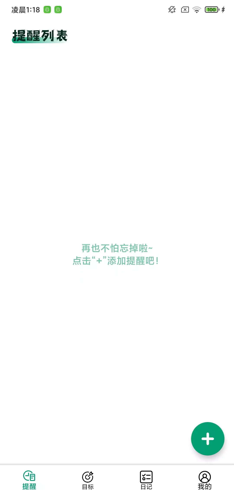
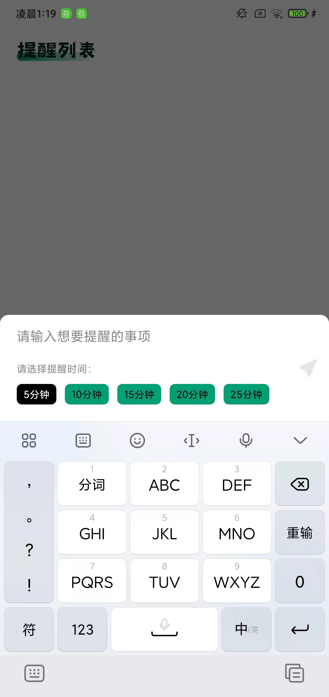
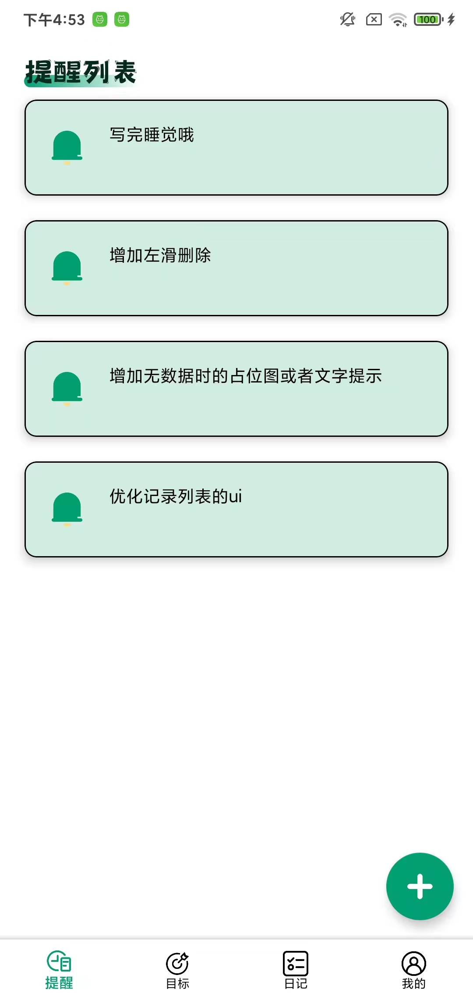
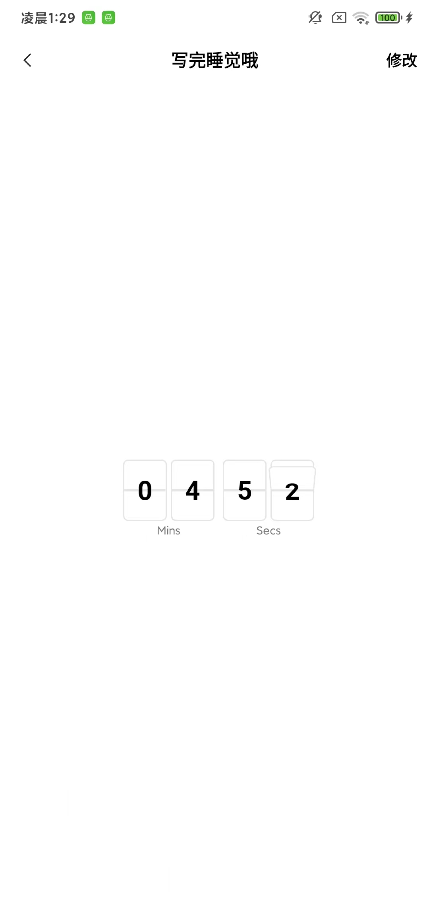
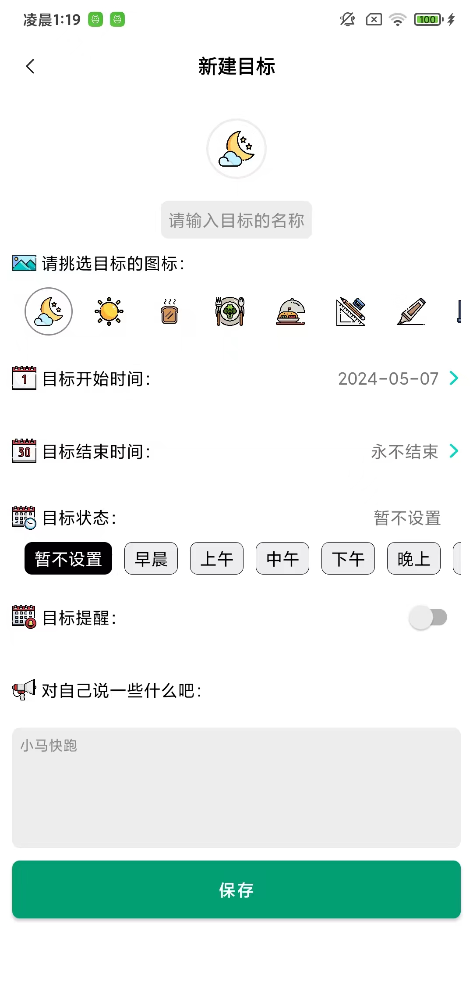
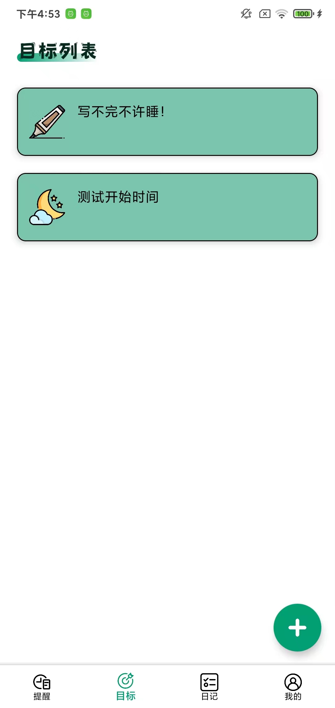
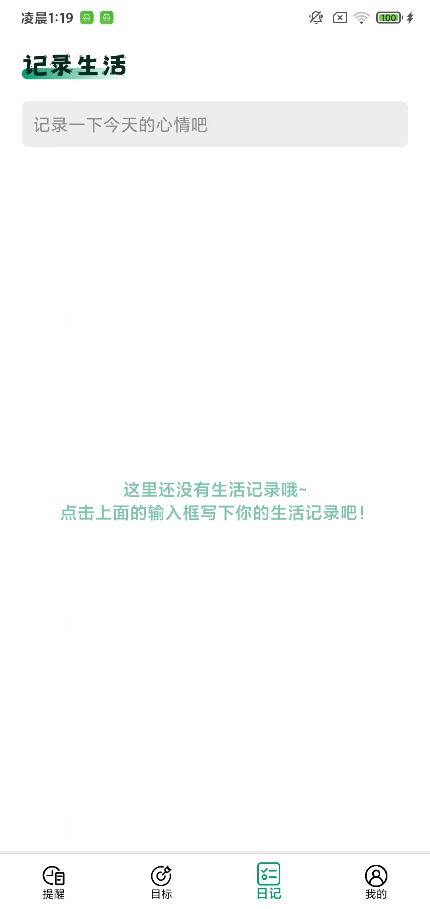
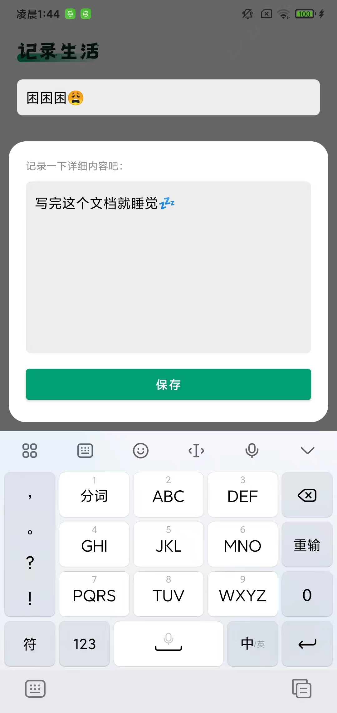
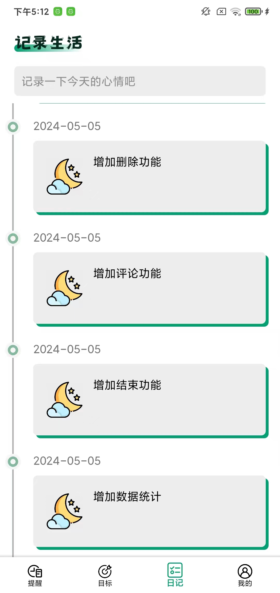
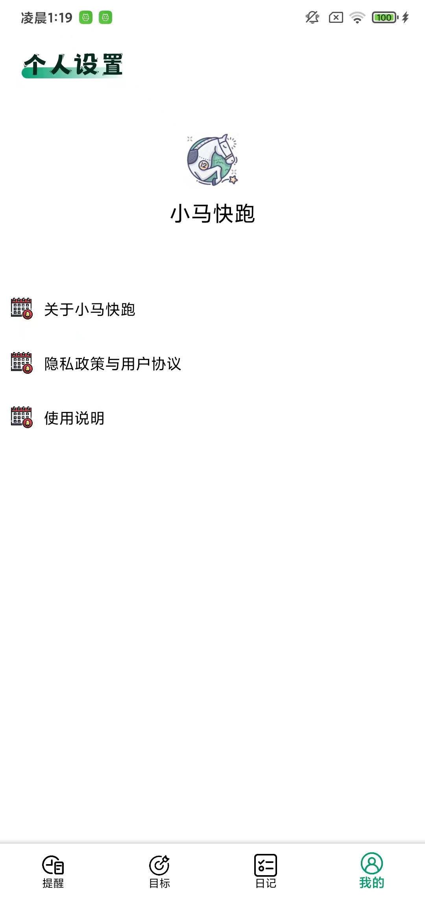

# 小马快跑

#### 简介

小马快跑是一款拥有事项提醒、目标管理和生活记录的工具类App，后续可能还会迭代其他的功能。

目前是Beta版本，后续在现有功能需求完成100%后，会发布Release版本
#### 分支
Beta1：https://github.com/ContentMy/RunFastXM/tree/beta1

#### 应用快照

* 事项提醒功能模块

  

* 目标管理功能模块

  

* 备忘记录功能模块

  

* 个人设置功能模块

  

#### 代码架构

架构模式：MVVM

分层架构：组件化/模块化

开发语言：Kotlin

开发库：Jetpack以及其他三方开源库（ARouter、BaseQuickAdapter等）

#### 功能架构

###### 整体导航

整体导航是沿用了传统的ViewPager+导航栏的模式，具体使用是ViewPager2+BottomNavigationView。因为是组件化的思想，所以也使用了阿里的ARouter来完成模块间的路由导航跳转

###### 事项提醒功能

> 主要负责一些事项的提醒，比如半小时或一小时后提醒，会在通知栏给到相应的通知以示提醒。
>
> 相对其他功能模块来说，数据条目会相对较少，目前仅需要输入事项内容以及选择提醒的时间，适合短期的小事项

* 已完成内容：
  * 提醒事项的添加（dialogActivity）
  * 提醒事项列表的展示
  * 提醒事项详情的展示（倒计时展示）
  * 增加提醒后一定时间弹出通知告知用户（目前为了测试写死一分钟，后续进行改动）
  * 提醒事项的删除（左滑删除）
  * 提醒事项的结束（结束不是删除，是一个状态，删除是从数据库中删除，结束可以再次提醒）
  * 不同状态事项列表的展示（待提醒的事项、已提醒的事项）
  * 提醒模块的引导功能
* 待完成内容：
  * 提醒模块页面的一些bug处理
* 后续考虑增加的功能内容(Release版本更新后开始增加)：
  * 提醒事项与目标管理的联动

###### 目标管理功能

> 主要负责目标的管理。是针对长期的一些事项，比如周期性的内容或者长远的规划又或者既定的一些目标。像是每天早晨7点跑步，每天9点开始写代码，每周不固定的游泳计划，每个月或者半年的旅游计划等等。
>
> 目前在所有模块中是属于最大的一个功能模块内容，后续增加打卡、分享、使用情况统计图等内容，数据输入内容相对其他模块也是较为繁琐一些，比如目标icon的选择、时间选择、名称输入、状态选择等等

* 已完成内容：
  * 目标的添加与修改
  * 目标列表的展示 
  * 目标的删除（左滑删除）
  * 目标的打卡（增加在列表条目中）
* 待完成内容：
  * 暂无
* 后续考虑增加的功能内容(Release版本更新后开始增加)：
  * 目标的详情（包含目标情况统计分析）
  * 目标的分享（在打卡和详情界面）

###### 记录生活功能

> 主要负责生活琐事的一些记录，主打一个随心，类似日志和备忘的功能

* 已完成内容：
  * 记录的添加与修改（dialogActivity）
  * 记录列表的展示（时间轴）
  * 记录的详情展示
  * 记录的删除（长按显示删除按钮）
  * 记录内容增加图片类型的添加条目
  * 记录列表item增加图片缩略图的展示
* 待完成内容：
  * 暂无
* 后续考虑增加的功能内容(Release版本更新后开始增加)：
  * 记录列表增加对于自己生活记录的每个item的单独评论
  * 记录详情页面添加图片的相册选择页面(现在是直接复用系统的选择)
  * 记录详情页面添加图片的照相功能
  * 记录详情页面点击图片可以单独展示

###### 个人设置功能

> 主要负责应用信息的展示、应用设置以及后续添加一些小功能的入口。是较为通用的一些ui展示内容，数据库方面在后续版本可能会考虑加入user表对个人数据进行管理以及后端数据的处理。但可能不会在Release新版本来做，应该会在比较靠后的版本中加入

* 已完成内容：
  * ui的简单展示
  * 关于小马快跑的页面跳转与展示
* 待完成内容：
  * 完成item的点击跳转ui与逻辑内容
  * 增加item设置内容（应用换肤、应用数据清除等）
* 后续考虑增加的功能内容：
  * 联合后端的user表数据管理，并做设备唯一ID的处理。但时间不确定，因为学习后端有一定时间成本
